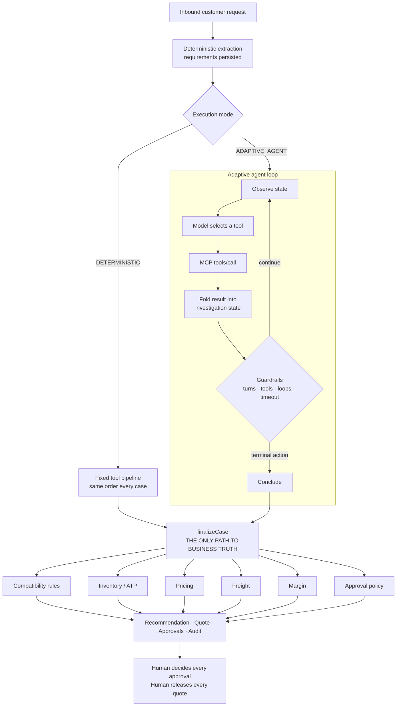

# Agent architecture

Sales Engine has two ways to work a case. They share everything except
orchestration.



---

## 1. The boundary

**The agent decides how to investigate. The engines decide what is true.**

| The model may | The model may not |
| --- | --- |
| Read a messy request and propose requirements | Decide a product specification |
| Choose which tools to call, and in what order | Decide whether a substitution is safe |
| Decide how much evidence is enough | Decide inventory or available-to-promise |
| Formulate search queries | Decide a price, discount, freight or margin |
| Compare returned evidence | Decide whether an approval is needed |
| Decide clarification is necessary | Approve, release, or send anything |
| Phrase a rationale from computed facts | Add a fact to that rationale |

This is enforced by shape, not by instruction. There is no tool that approves
anything. There is no tool input that carries a technical fact. The prompt
restates none of the business rules, because a prompt that paraphrased them
would be a second, weaker copy that drifts from the engines.

## 2. Why `finalizeCase` is the whole design

Both modes converge on one function. The deterministic pipeline supplies
candidates from curated replacement links plus a catalog screen; the agent
supplies whatever it decided to investigate. From that point the code is
identical: every candidate is re-evaluated against the compatibility rules,
re-priced by the pricing engine, re-planned against real stock, and re-tested
against approval policy.

So an agent can influence **which products get looked at** — and nothing else.
It cannot reach the numbers, because the numbers are computed after it has
stopped talking.

This is why the adaptive run of REQ-2041 produces the same quote as the
deterministic one: PX-440 × 12, $102,808.88, 30.38% margin, three approvals.
Different route, same truth. That equality is asserted in
`tests/integration/adaptive.test.ts`.

## 3. The loop

`src/lib/agent/adaptive/runtime.ts`.

```
observe → model selects tool(s) → MCP tools/call → fold into state → guardrails → repeat
                                                                   ↓
                                                          terminal action → finalizeCase
```

Each iteration: check the budget, ask the model for its next move, execute the
tools it chose through the MCP client, fold each result into investigation
state, and feed the results back. Nothing else is remembered — state is the
agent's memory, and only tool results write to it.

### Why not the Claude Agent SDK

The Agent SDK targets long-lived assistant sessions with filesystem and shell
access and its own permission model. What this needs is narrower and stricter:
a bounded loop over one MCP server with turn and tool budgets, loop detection,
state validation after every call, and headless operation inside a Vitest
process with no credentials. A direct Messages API tool-use loop over the MCP
client gives exactly that in about two hundred inspectable lines, and leaves
MCP as the only tool surface — which is the part that had to be real. Swapping
the runtime later changes one file; the MCP layer and the engines would not
notice.

## 4. Investigation state

`src/lib/agent/adaptive/state.ts`.

The agent does not reason out of its conversation history. Facts live in a
typed structure written *only* by `applyToolResult`, a total switch over tool
names with no inference in it. That buys three things:

- **Grounding.** A claim in the final output is checked against state, and
  state entries exist only because a tool produced them.
- **Preconditions.** `canDraftQuote` refuses a conclusion where a candidate was
  never compatibility-checked, the account was never resolved, or no quantity
  was established — *before* the agent spends its one terminal action.
- **Truthful narration.** The operator-facing step list is derived from state,
  so it can only describe work that happened. It is persisted to
  `AgentRun.trace` at the end of the run, alongside the tool calls themselves.

A tool that is built on another — `build_fulfillment_plan` runs
`check_inventory`, `find_substitutes` runs `screen_candidates` — records both,
but only the outer one is marked `modelInitiated`. The agent chose the outer
call; the outer call chose the inner. An "agent chose" mark is only worth
reading if it means exactly that.

## 5. Termination

Exactly one terminal tool ends a run:

| Tool | Termination | Effect |
| --- | --- | --- |
| `create_quote_draft` | `READY_FOR_APPROVAL` (or `NEEDS_INTERNAL_REVIEW` if grounding fails) | `MUTATION` |
| `respond_with_information` | `INFORMATION_PROVIDED` (or `NEEDS_INTERNAL_REVIEW` if grounding fails) | `MUTATION` |
| `request_clarification` | `NEEDS_CUSTOMER_CLARIFICATION` | `MUTATION` |
| `escalate_for_review` | `NEEDS_INTERNAL_REVIEW` | `HUMAN_GATED_MUTATION` |

### Answering a question

Live running showed the gap plainly: asked "can the MX-160 handle 175 °C?",
the agent had the answer after two tools and then had nowhere to put it. Its
only endings were to ask a clarifying question it did not need, or to build a
quotation nobody had requested. Both are wrong answers to a right question.

`respond_with_information` is the missing ending. It terminates the run with
an answer and touches no commercial state at all — the deterministic finalizer
is never invoked on this path, so there is no code path from answering to a
price, a quote, an approval or a release. That is structural, not a rule the
tool promises to follow.

Its input is deliberately not free prose:

| Field | What it is for |
| --- | --- |
| `answer` | The customer-facing text, graded like any other claim |
| `claims` | The assertions the answer rests on, one per entry, each graded |
| `evidenceRefs` | Sections supporting them, exactly as retrieval returned them |
| `skus` | Parts the answer is about |
| `uncertainty` | What the evidence does not settle |

Two gates, both existing machinery rather than a second validator:

1. **Before the action is spent.** `canRespondWithInformation` mirrors
   `canDraftQuote`: every citation must be one a tool returned *in this run*,
   and every part named must be one this run looked up — found, ruled out, or
   established as missing. A miss is a `FORBIDDEN_EFFECT` the model can
   recover from, not a lost run.
2. **Before anything is drafted.** The answer and every claim go through
   `checkGrounding` unchanged. An invented price, stock figure, part number or
   citation is rejected exactly as it would be in a recommendation, and the
   case goes to a person with no letter written.

`claims` was added to the graded prose for this. An informational outcome is
almost entirely assertion, so leaving the claims ungraded would have made the
one conclusion that is purely factual the one nobody checked.

`escalate_for_review` earns its classification: it raises a pending
`TECHNICAL_UNCERTAINTY` approval that an application engineer must decide. A
blocked case sitting in nobody's queue would make the label decorative.

A run that never concludes terminates `GUARDRAIL_STOP`; a provider outage
terminates `FAILED`. Both route the case to a human and leave no quote behind.
The model cannot invent a status — these are a closed enum, and the mapping
from tool to status is in code.

### Release is decided after grounding, not before

The deterministic pipeline releases a quote inline when every policy check is
inside limits. The adaptive path holds that decision back (`deferAutoRelease`)
until the grounding verdict is in, so a quote is never released on the strength
of a summary that is about to be rejected. The eligibility decision is still
the finalizer's; only its timing moves.

## 6. Guardrails

`src/lib/agent/adaptive/guardrails.ts`. Defaults: 18 turns, 30 tool calls,
180s, 2 identical calls, 3 consecutive invalid arguments.

| Trip | Behaviour |
| --- | --- |
| Turn / tool / time budget | Run stops, case → `NEEDS_REVIEW` |
| Repeated identical call | Refused **with an explanation** — silently dropping it just makes the model try again |
| Invalid arguments | Returned as a readable tool error; three consecutive abandons the run |
| Unknown tool | Refused, recorded, loop continues |
| Precondition failure on a terminal tool | Refused with the missing step named |
| Provider error | Run ends `FAILED`; an outage is not a safety verdict |

Argument comparison uses a key-order-independent stringify, so reordering keys
cannot defeat loop detection.

## 7. Grounding

`src/lib/agent/adaptive/outcome.ts`. The structured outcome is Zod-validated,
then checked against state:

| Check | Rejects |
| --- | --- |
| `UNKNOWN_SKU` | A token that is neither a catalog part number nor a document on file |
| `UNCHECKED_COMPATIBILITY` | A recommendation that never went through the engine, or that failed a hard rule |
| `UNGROUNDED_INVENTORY` | A stock figure no inventory or fulfillment result returned |
| `UNGROUNDED_PRICE` | A money figure the pricing engine never returned |
| `UNGROUNDED_EVIDENCE` | A citation no document search produced |
| `INTERNAL_LANGUAGE_LEAK` | Margin or cost language in a question bound for the customer |

Three of these are stricter than they look, deliberately:

- Document numbers (`DS-1020`) are shaped exactly like part numbers, so the
  catalog of *both* is passed in. Otherwise a correctly cited piece of
  evidence reads as a fabricated SKU and the happy path fails on itself.
- **Every** money figure must match one the engine returned, not merely one of
  them. A rule satisfied by any single match waves through the dangerous
  shape: a true unit price lending credibility to an invented total.
- A stock claim is checked against the number. Checking only that *an*
  inventory tool ran would let "180 units in stock" pass on a lookup that
  returned 6.

Clarification questions are graded alongside the summary, because they are
drafted straight into the letter the customer receives. Where a question fails,
the agent's wording is dropped entirely and the case goes to a person — the
deterministic open questions still stand.

An ungrounded summary is **not** quietly rewritten. The case is routed to a
human, because a recommendation nobody can trace is worth less than none. The
quote and approvals the finalizer produced still stand — they were never the
model's to make.

One subtlety worth stating: the check grades the **model's** rationale, not the
recommendation text `finalizeCase` assembled. The latter is authoritative by
construction, and grading it against the agent's own state would flag correct
engine figures the agent never had to look up.

### What live running changed

Grounding was first exercised against a scripted model, which only ever sends
arguments we wrote for it. A real model writes its own prose, and five of the
first live suite's seven failures turned out to be the validator rejecting
correct work:

| Rejected | Why it was wrong |
| --- | --- |
| `REQ-2036` as a fabricated part | A case reference from `get_customer_history` is shaped like a part number |
| `PX-450` as a fabricated part | Saying "PX-450 is not one of ours" requires naming it |
| `RG-120` as hard-failed | The agent saw it fail on `connection`; the finalizer then fitted the adapter that resolves exactly that |
| `$6,364` as an invented price | The engines format to two decimals; the model wrote the round form |
| `$154,303.72` as an invented total | Freight lands after `calculate_price`, so the total exists only on the finalizer's quote |

Four of the five are the same mistake: **grading the finalizer's output
against the agent's earlier snapshot.** Where the deterministic finalizer has
ruled, grounding is given its ruling — its compatibility verdict on the
winning candidate and its own money — and the agent's state is used only to
catch a product that never went through the engine at all.

A validator that rejects correct work is not a safe default. It routes sound
cases to a person, which is the most expensive failure this layer has, and it
trains whoever reads the queue to ignore it.

The rejections that remained were true positives every time, and all of them
were the model asserting a number in prose that no tool had produced — a
fabricated stock figure, an invented price. That is the shape of error this
layer exists for, and it caught every one.

## 8. Trust boundary

Three kinds of content reach the model, and they are not equal:

1. **System instructions** — authoritative.
2. **Tool results** — factual data. Trustworthy as data, never as instruction.
3. **Customer messages and retrieved document text** — untrusted material.

Inbound requests are wrapped in explicit markers and labelled untrusted. A
document section arrives as a field inside a structured payload; it is never
spliced into the instruction channel.

The real defence is not the prompt. It is that **obeying an injection changes
nothing**: there is no tool that approves, releases, discounts or fabricates.
`tests/integration/prompt-injection.test.ts` scripts a *maximally obedient*
model against a request demanding it skip checks, assume 500 units of stock,
apply 70% off and mark the quote approved — and asserts the outcome is still
safe, the discount is still the price book's, and every approval is still
pending.

## 9. Observability

Per run: mode, model, start/end, duration, turn count, tool count, termination
status, error category, input/output tokens, estimated cost, guardrail events
and the structured outcome. Per tool call: name, input, output, status, safety
class, **effect**, **whether the model chose it**, duration and evidence.

Cost is only estimated when the provider actually reported usage. Deterministic
runs leave the adaptive columns null rather than zero, so "not applicable" and
"measured zero" stay distinguishable.

## 10. Failure modes and what happens

| Failure | Result |
| --- | --- |
| Provider outage | `FAILED`, case → `NEEDS_REVIEW`, no quote, suggests the deterministic workflow |
| Model loops | Refused with explanation, then `GUARDRAIL_STOP` |
| Model invents a tool | Refused and recorded; loop continues |
| Model insists on a blocked part | Terminal action refused with the reason; if it persists, no quote exists |
| Model fabricates a price or citation | Grounding rejects it; case → human review |
| Model concludes without checking compatibility | Precondition refuses before the action is spent |
