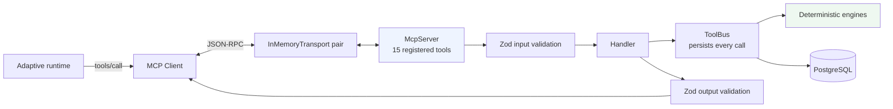

# MCP

The tool layer is a real Model Context Protocol server built on the official
TypeScript SDK — `@modelcontextprotocol/sdk` — not a set of application
functions renamed "tools".

## What makes it real

| | |
| --- | --- |
| Server | `McpServer` from `@modelcontextprotocol/sdk/server/mcp.js` |
| Client | `Client` from `@modelcontextprotocol/sdk/client/index.js` |
| Transport | `InMemoryTransport.createLinkedPair()` |
| Protocol | Genuine JSON-RPC: `initialize`, `tools/list`, `tools/call` |
| Schemas | Zod input **and** output schemas per tool |
| Responses | `structuredContent`, validated against the output schema |
| Errors | `-32602` for invalid arguments and unknown tools; `isError` for domain refusals |
| Annotations | `readOnlyHint`, `idempotentHint`, `destructiveHint`, `openWorldHint` |

`tests/integration/mcp.test.ts` drives all of this through a real client, so
what is exercised is the protocol rather than a direct call wearing its name.

### Why in-process

The transport is in-memory by choice. The protocol, the schemas and capability
negotiation are all genuine; the process boundary a stdio or HTTP transport
would add buys nothing for this demonstration and would make the whole thing
painful to run inside a test. Swapping to stdio is a two-line change in
`client.ts` and nothing above it would notice.

## Architecture

The server owns the database handle. The model talks to the server; it never
sees a connection string, an API key or an environment variable, because none
of those appear in any tool's input or output schema — asserted in
`tests/unit/mcp-contracts.test.ts` and again over the wire in the integration
tests.

## The tools

| Tool | Effect | Idempotent |
| --- | --- | --- |
| `resolve_customer` | READ_ONLY | yes |
| `get_request_state` | READ_ONLY | yes |
| `resolve_sku` | READ_ONLY | yes |
| `search_catalog` | READ_ONLY | yes |
| `get_product` | READ_ONLY | yes |
| `search_technical_docs` | READ_ONLY | yes |
| `get_inventory` | READ_ONLY | yes |
| `get_customer_history` | READ_ONLY | yes |
| `check_compatibility` | DETERMINISTIC_COMPUTATION | yes |
| `find_substitutes` | DETERMINISTIC_COMPUTATION | yes |
| `build_fulfillment_plan` | DETERMINISTIC_COMPUTATION | yes |
| `calculate_price` | DETERMINISTIC_COMPUTATION | yes |
| `create_quote_draft` | MUTATION | no |
| `request_clarification` | MUTATION | no |
| `escalate_for_review` | HUMAN_GATED_MUTATION | no |

There is deliberately no `process_rfq`. A single do-everything tool would put
the orchestration back inside the application and leave the agent with nothing
to decide — which is the thing this phase exists to demonstrate.

There is equally deliberately no tool whose name contains *approve*, *release*,
*send* or *override*. A unit test enforces that.

### Effect classification

| Effect | Meaning |
| --- | --- |
| `READ_ONLY` | Reads application data. No side effects. |
| `DETERMINISTIC_COMPUTATION` | Runs an engine over stored data. Same inputs, same answer. No side effects. |
| `MUTATION` | Writes to the case. Cannot release anything to a customer. |
| `HUMAN_GATED_MUTATION` | Creates a record a named human must then decide. |

The classification travels to the model **through the protocol** — appended to
each tool's description and mirrored in its annotations — rather than only
living in our UI. It is persisted on every recorded call, and the Agent Lab
inspector renders it.

## Two rules the contracts enforce

### Tools take selectors, never facts

`check_compatibility` takes a SKU. It does **not** take requirements — those
are loaded from the case inside the handler. A caller that could pass its own
requirements could make any product pass any check, which would make the whole
compatibility layer decorative.

A unit test asserts no tool input key matches `/temp|pressure|flow|material|
stock|inventory|price|margin|discount|rating|spec/i`, and an integration test
passes a fabricated requirement set over the wire and confirms it is ignored —
AX-220 still fails on temperature.

The `quantity` argument on `calculate_price` and `build_fulfillment_plan` is a
confirmation, never a source. Omit it and the extracted figure is used. Pass a
different one and the tool refuses, naming the real number. Pass one when the
customer's message stated no quantity at all and the tool also refuses — there
is nothing to confirm against, and quantity drives volume breaks, freight and
margin, so authoring it would hand the model the number the whole commercial
calculation rests on.

### Errors are written for the reader

An invalid part number comes back as a tool error the model can act on —
*"No catalog product with part number 'ZZ-0000'. Use search_catalog or
resolve_sku to find the right one rather than guessing."* — not as an exception
that kills the run. Anything that is genuinely our bug propagates.

## Every MCP call is a recorded tool call

Calls go through the same `ToolBus` the fixed pipeline uses: same table, same
evidence rows, same trace the operator reads back. Each carries its effect and
a `modelInitiated` flag, so a trace distinguishes *the agent chose to do this*
from *the finalizer did this on the way to a quote*.

One bus per run, so the sequence numbers form a single ordered series rather
than two colliding ones — which is what a reader needs for the trace to be a
story instead of a pile.

## Adding a tool

1. Add a contract to `TOOL_CONTRACTS` in `src/lib/mcp/contracts.ts` — title,
   description written for the model, Zod input/output schemas, effect,
   idempotency.
2. Add a handler to `HANDLERS` in `src/lib/mcp/handlers.ts` that calls an
   existing engine or query. Do not reimplement business logic.
3. That is all. The server registers it, the runtime offers it to the model,
   the inspector renders it, and the contract tests cover it.
